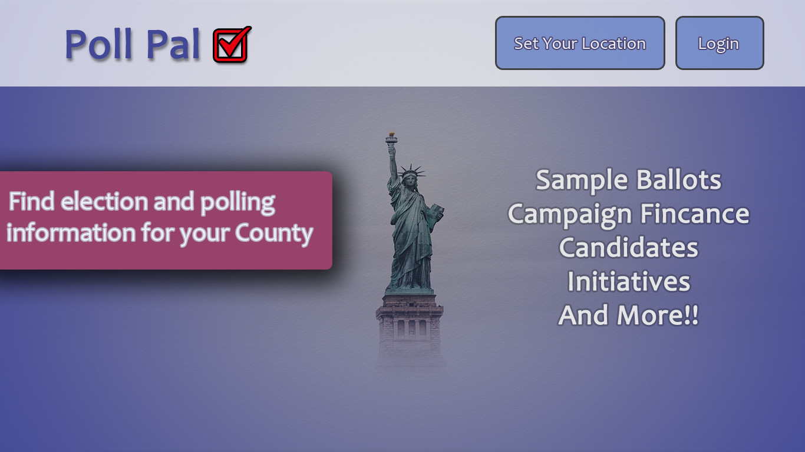
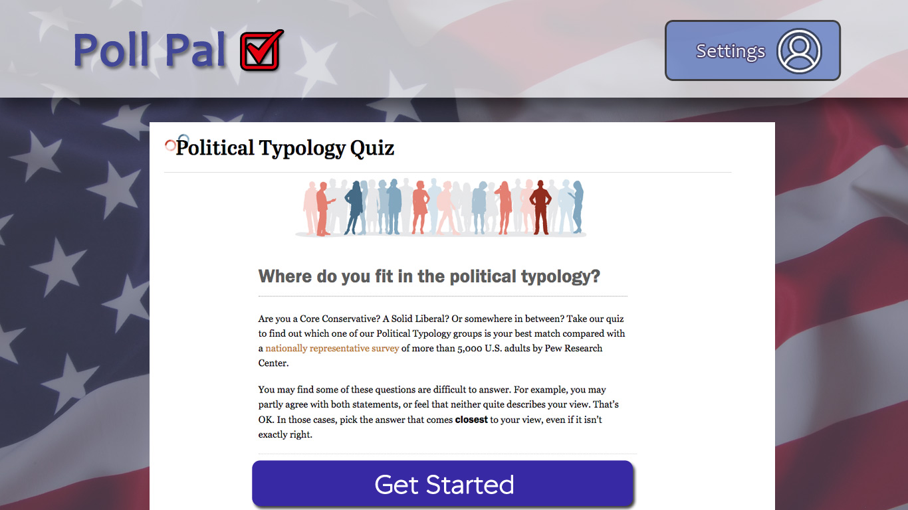
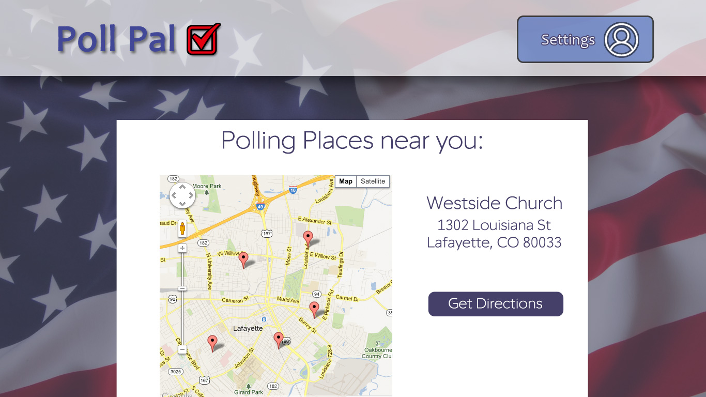

# UI Kit and UX methodology for Poll Pal

We have a couple different options for moving forward with the UI/UX startegy for Poll Pal.

Because this is a voting app we would like to emphasize the United States government by featuring the Statue of Liberty and the US flag.  

## Color Scheme
The main color scheme of US gevernment consists of red, white and blue.  Because we would like to convey this in out application we will use these colors and possibly add purple to represent the combination of red and blue.

## UI Kit
We will be using Bootstrap 4 to create the main scaffolding for the project because of the column grid scheme and the premade buttons and components.  
It is the hope of Poll Pal to extend the CSS colors in Bootstrap to better match our desired layout.

## Fonts
The main font used in our application is Red Ring Light.   Its a featured Open Typeface and makes any typography look more modern.

## Mobile-first
Because we are using Bootstrap 4 all of our designs will scale easily to support mobile devices.  

# Landing Page
We currently have 3 options for the landing page. Depending on the landing page we decide to proceed with, the rest of our application will follow the styling convention. 
Option #1

Option #2

Option #3

# Search Page
Option #1 - Left-Aligned

Option #2 - Center-Aligned

# Survey Page

# Map Page

